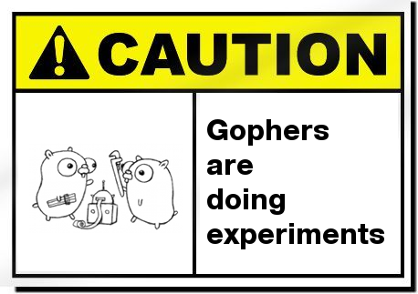

<p align="center">

</p>

# fsx

[](https://github.com/FollowTheProcess/fsx)
[](https://pkg.go.dev/github.com/FollowTheProcess/fsx)
[](https://goreportcard.com/report/github.com/FollowTheProcess/fsx)
[](https://github.com/FollowTheProcess/fsx)
[](https://github.com/FollowTheProcess/fsx/actions?query=workflow%3ACI)
[](https://codecov.io/gh/FollowTheProcess/fsx)

Clean, simple filesystem abstraction for Go 🗃️

> [!WARNING]
> **fsx is in early development and is not yet ready for use**



## Project Description

`fsx` is a minimal, simple filesystem abstraction for Go, allowing you to interact with a filesystem in a completely agnostic way whether it's the real OS filesystem, an in-memory filesystem for testing, or anything else!

It's inspired by projects like [spf13/afero], [C2FO/vfs] and [go-git/go-billy].

### So why another one?

Good question!

1. The alternatives don't *quite* do what I want (although [go-git/go-billy] is the closest)
2. They have additional features and functionality I don't need or want (like S3 support, fully qualified URIs etc.) or APIs that I don't think are optimal
3. I like building things 🤷🏻‍♂️ it's the best way to really understand how something works

## Installation

```shell
go get github.com/FollowTheProcess/fsx@latest
```

## Quickstart

### Credits

This package was created with [copier] and the [FollowTheProcess/go_copier] project template.

[copier]: https://copier.readthedocs.io/en/stable/
[FollowTheProcess/go_copier]: https://github.com/FollowTheProcess/go_copier
[spf13/afero]: https://github.com/spf13/afero
[C2FO/vfs]: https://github.com/C2FO/vfs
[go-git/go-billy]: https://github.com/go-git/go-billy
